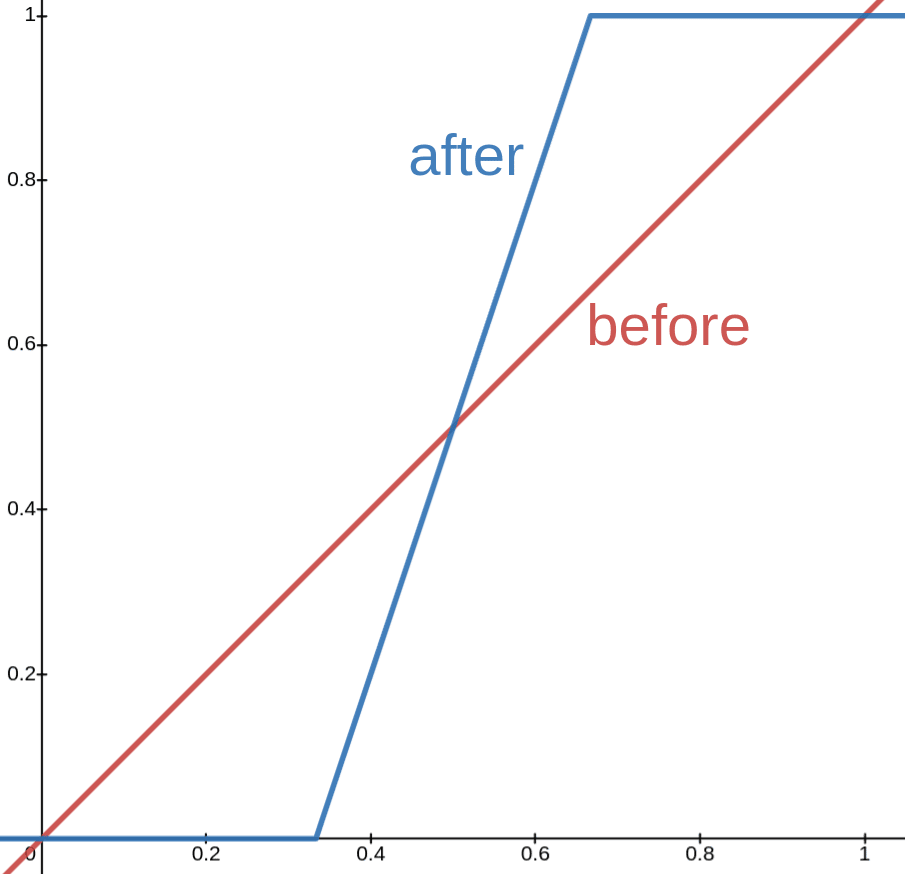

## **Shaped Terrain 2** {#shaped-terrain-2}

### *Goal* {#goal-4}

Let’s go through another idea: What if we made our threshold not a formula for a shape but instead… another noise function\! This way, we should be able to make terrain out of noise whose surface is made out of another noise function.

### *Step-by-Step* {#step-by-step-4}

Let’s try something like this, where we use a low-frequency noise function as the threshold *thresh=perlin(1,x,y,z,1,1,1);*, and a high-frequency noise function for the original noise pass *noise=perlin(1,x,3\*y,z,3,2,2);*:

| *//g 35  thresh=perlin(1,x,y,z,1,1,1);  noise=perlin(1,x,3\*y,z,3,2,2);  noise\>thresh* |
| :---- |

*(Command 6.4.13)*

This, however, does not create something useful just yet. Our threshold is not “strong” enough (see bottom left image). To fix it we could use the raising-to-a-power-approach, but for the sake of introducing another tool, we’re gonna do a simple transform using this formula instead: a(x-0.5)+0.5.

This will simply decrease the volume in which our threshold will be between 0 and 1 thus increasing the areas of all air/filled terrain.

| thresh | 2\*(thresh-0.5)+0.5 | 8\*(thresh-0.5)+0.5 |
| :---- | :---- | :---- |
|  |  |  |
|  |  |  |

Alright\! While previously we only had a torus with a noisy surface, now we’ve got terrain that has the shape of perlin noise but the surface consists of a high-frequency perlin noise.

Let’s try out an idea for coloring: Just using the threshold variable *color=thresh*. This way we should be able to make the parts that “stick out” be one color, while the blocks that are “tucked in” more be another color. Just like [back here](shaped_terrain.md#understanding) where the upper parts of the terrain were red and changed in color going further down. We also mustn’t forget to clamp the color to stay within 0 and 1: *color=min(1,max(0,thresh))*. And finally, one final touch-up that I won’t explain, *(thresh+0.2)/1.2*, leaves us with:

| *//g 35  thresh \= 12\*(perlin(1,x,y,z,1,1,1)-0.5)+0.5;  noise \= perlin(1,x,3\*y,z,3,2,2);  color \= min(1,max(0,(thresh+0.2)/1.2));  data \= color\*15.99;  noise \> thresh* |
| :---- |

*(Command 6.4.14)*

And what’s really cool about this is being able to easily change any parameter or even switching out a noise function:  

| *//g 35  thresh \= 8\*(perlin(1,x,y,z,1,1,1)-0.5);  noise \= voronoi(1,x,3\*y,z,8);  color \= min(1,max(0,(thresh+0.1)/1.1));  data \= color\*15.99; noise\>thresh* |
| :---- |

*(Command 6.4.15)*  
Here’s yet another example of the same noise \> thresh concept.

Here we combine these first two expressions for our threshold with the third expression for our noise pass to get the following result:

| perlin(15,x,y,z,1,2,1) | sqrt(x\*x+y^4\*50+z\*z) | (1-ridgedmulti(1,x,y/2,z,6,1))\* (1-ridgedmulti(9,x,y/2,z,7,2))  |
| :---- | :---- | :---- |
|  |  |  |

| *//g 35  thresh \= 2\*(perlin(15,x,y,z,1,2,1)+sqrt(x\*x+y^4\*50+z\*z)-1);  rm \= 1-ridgedmulti(1,x,y/2,z,6,1);  rm2 \= 1-ridgedmulti(9,x,y/2,z,7,2);  noise \= (1-cos(pi\*rm\*rm2))/2;  color \= min(1,max(0,(thresh+0.2+y)/1.1));  data \= color\*15.99; noise\>thresh* |
| :---- |

*(Command 6.4.16)*