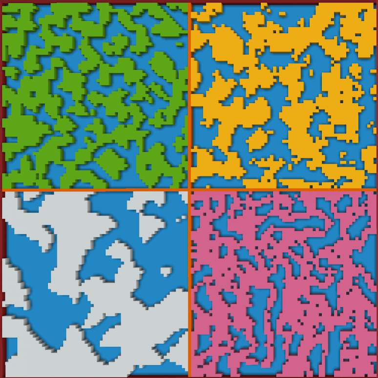
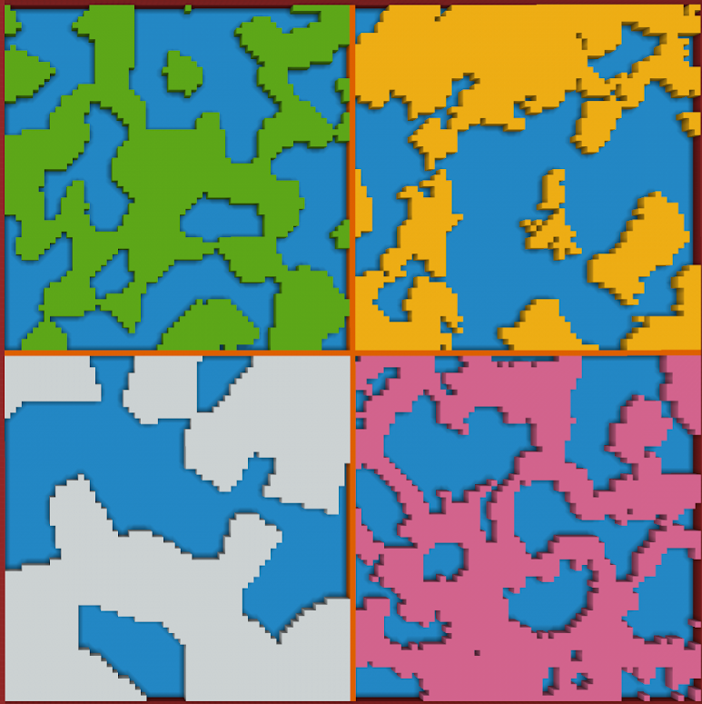

# FAWE In-built Patterns {#fawe-in-built-patterns}

While the noise functions provided by WorldEdit can appear complex, you can start with something much simpler by using the inbuilt noise pattern within FastAsyncWorldEdit.  
If you are only using default WorldEdit and then you can skip this section.

In FAWE you have access to four different noise patterns:

| Colour | Command |
| :---: | :---: |
| *Lime* | \#simplex\[**6**\]\[lime,air\] |
| *Yellow* | \#perlin\[**6**\]\[yellow,air\] |
| *White* | \#voronoi\[**6**\]\[white,air\] |
| *Pink* | \#rmf\[**6**\]\[pink,air\] |

| Colour | Command |
| :---: | :---: |
| *Lime* | \#simplex\[**12**\]\[lime,air\] |
| *Yellow* | \#perlin\[**12**\]\[yellow,air\] |
| *White* | \#voronoi\[**12**\]\[white,air\] |
| *Pink* | \#rmf\[**12**\]\[pink,air\] |

The syntax for each is *\#NOISE\[**SCALE**\]\[**PATTERN**\]* where you replace “**NOISE**” with the type you wish to use.

For all examples you can think of “**SCALE**” as how far you want to zoom in. A larger value results in the noise being stretched out in all directions. When it comes to the “**PATTERN**”, you can put any pattern you want in there, and as many as you want. Although you will need at least two or it will be solid.

These can all be especially useful for texturing your builds, and you can create some very intricate designs by stacking them inside each other.

| *//set \#perlin\[20\]\[grass\_block, \#perlin\[12\]\[\#voronoi\[12\]\[coarse\_dirt,moss\_block\],green\_concrete\]* |
| :---- |

*(Command 4.1.1)*

| *//set \#rmf\[24\]\[\#simplex\[12\]\[purple,magenta\], \#voronoi\[6\]\[blue,light\_blue\],cyan\]* |
| :---- |

*(Command 4.1.2)*

If all you need is quick patterns then this can be very handy despite their lack of customisation.  
In addition to these patterns, if you have the Arceon plugin then you get a few more extra [noise patterns](https://github.com/Brennian/Arceon/wiki/Patterns#turbulence-pattern) and [masks](https://github.com/Brennian/Arceon/wiki/Masks#turbulence-mask) too.

We will now move on to the noise functions within Expressions, where you can control a lot more of how they work and create more interesting, unique shapes and patterns.