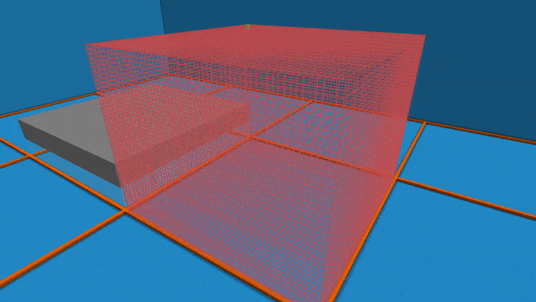

### *Normalized Coordinate System* {#normalized-coordinate-system}

When //generate runs through every block to evaluate our expression, it (by default) does not use the game’s absolute world coordinates like the expression masks from before did, but instead uses normalized x,y,z coordinates relative to your selection. That means every block in your selection will be assigned a “new” set of coordinates. The new coordinates depend on the position within/relative to your selection.  
Here’s a small example visualization of the coordinate values that the blocks within a 9x9x9 selection will have[^5]:

| x | y | z |
| ----- | ----- | ----- |
|  |  |  |

Where we mapped red to \-1, white to 0, and blue to 1. With gradients showing e.g. pink for \-0.5.

In fact, by default the x,y,z variables range from **\-1** to **1**, generally being decimal numbers like 0.2, \-0.33, 0.95, and so on. That means, **regardless of the location or size of your selection**, the highest layer of blocks in your selection will have y-coordinate **1** and the lowest layer will have y-coordinate **\-1** (see [e.g.](../appendix_a.md)), while all of the coordinates in between are uniformly spaced decimal values filling in the gap. In our 9x9x9 case those values would be \-1.0, \-0.75, \-0.5, \-0.25, 0.0, 0.25, 0.5, 0.75, 1.0. “We're not doing y==65 anymore, we're doing like y==0.5 now.”

So for example the front cube of the top layer: In the first image, which resembles x, the cube is red, so its x is \-1. While the other two images, for y and z, the cube is blue, meaning y and z are 1\. Thus, its new relative coordinates are (-1,1,1). 

Here’s a simple question to test whether you understand how //generate handles coordinates. What will *(Command 2.1.1)* generate (in a 9x9x9 selection)? Can you perhaps visualize it in your head?

| *//generate white\_concrete (x==0)||(y==0)||(z==0)* |
| :---- |

*(Command 2.1.1)*  
The answer is below:
  
>! Answer: The expression essentially says: A block is placed if and only if one (or more) of its x,y,z coordinate values is zero. With //generate this is the case for the three center layers for each respective axis, because as mentioned //generate uses a normalized coordinate system fitted to your selection going from \-1 on one side, to 0 in the middle[^6] and to 1 on the other side for each axis.

Here are a few more visualizations of some expressions within the normalized coordinate system together with somewhat related example commands. The given expression is evaluated for every cube using its relative coordinates. The output of the expression determines the color of the cube.

| (x+y+z)/3 | x\*x+z\*z | abs(x)+abs(y)+abs(z)-1.5 |
| :---: | :---: | :---: |
|  |  |  |
| [Example command](../appendix_a.md#appendix-a-diagonal-plane) | [See Command 2.1.2]  | [Example Command](../appendix_a.md#appendix-a-octahedron)  |

Where we mapped red to \-1, white to 0, and blue to 1. With gradients showing e.g. pink for \-0.5.

*To help your understanding of how each expression produces these results. Go through some sample x,y,z values for the expression and calculate what comes out. Why are these cubes colored the way they are? What would they look like if we only leave the white cubes? Etc.*

Another neat effect of relative coordinates is that the generated shape is independent from the selection location or size. This is demonstrated in the next example:

Going back to the middle expression, a filled circle is defined by all points which are at most a certain distance away from the center. That means we can easily generate a circle or cylinder around the center of our selection as it is also the origin of our coordinate system just by checking if x²+z² \<1 . Or if we want to be a bit more efficient: x²+z² \<1²  

| *//generate quartz\_block x\*x+z\*z \< 1* |
| :---- |

*(Command 2.1.2)*

Another fun example: If we map our y-axis from \[-1,1\] to \[0,1\], we can treat the y value as the probability of a block being placed. To achieve this we can use the random() function which returns a random value in the range \[0,1). As you can see the upper layers have a higher probability of being placed because they are close to 1 while below it’s the other way around.

| *//generate large\_fern y=(y+1)/2; y \> random()* |
| :---- |

*(Command 2.1.3)*

Displaying gradients through randomness can be very versatile, see e.g. [this](../appendix_a.md#appendix-a-fluffy-ball).

[^5]: If you were facing north-east in-game that is.
[^6]: Note however that there will not be a 0 layer if there are an even amount of blocks.