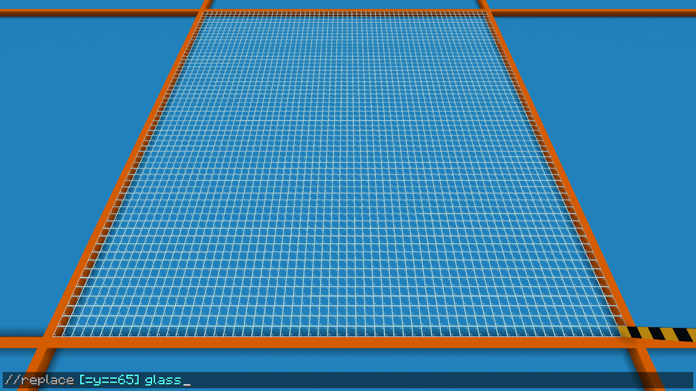

### *Expanding* {#expanding}

Moving to a more useful demo, say we had a 16 block high region and we wanted to change the bottom 8 layers to glass and the top 8 layers to stone. This is where expressions become very powerful as they are run on each block individually and can evaluate based on that block’s properties, with the most important being the block’s coordinates.  
These coordinates are referenced with the built-in variables ‘**x**’, ‘**y**’, & ‘**z**’.

If you want to know the coordinates and size of your selection then the *//size* command can be handy[^3].

We can see here our lowest Y-level is **65**, so now we need to make a command that will change the bottom 8 layers for us, and then a second to change the top 8 layers. First, we will look at just changing the bottom layer at Y-level **65**, we can achieve this by solely using the equals operator (**\==**). This is the operator we use to check whether two things are equal to each other or not. It's evaluated to True or False respectively.  

| *//replace \[=y==65\] glass* |
| :---- |

*(Command 1.3.1)*

In (*Command 1.3.1)* we can see a basic example of how to use the coordinate values of the block to replace blocks with glass wherever the Y-level is equal to **65**.   
Keep in mind that the expression is evaluated for every block and that the x,y,z variables will be set to the respective coordinates of the block. For example, where the Y-level of a block in the selection is **65**, the **y** variable will be evaluated as **65**, at a Y-level of **100** that **y** variable will be **100**. Meaning in (*Command 1.3.1)* only blocks with a y-coordinate of **65** will evaluate the expression *y==65* as *65==65* which then returns true. Meanwhile all other layers won’t be filled because for example the blocks at Y-level **66** will evaluate the expression *66==65* which of course returns false.

Since our selection is 16 blocks tall and we want to change the lower 8, we can do this by changing the command to replace wherever the Y-level is less than **65+8** using the less than operator (**\<**). We could of course write **73** but it’s easier to have **65+8** if we decide later that we would like to change the first 4 layers instead.

| *//replace \[=y\<65+8\] glass* |
| :---- |

*(Command 1.3.2)*

Now swapping it to *\>=65+8* (greater-than or equal to 65+8) we are going to replace blocks with stone wherever the Y-level is either **73** or more than **73**.

| *//replace \[=y\>=65+8\] stone* |
| :---- |

*(Command 1.3.3)*

However, the only reason our command is placing 8 rows and not more is because of our selection. If we expand the selection up it will keep placing blocks. We can see this by expanding our selection size.

We can of course combine this with other operators in interesting ways within our expressions. Such as using the modulo operator to replace every 3rd layer of a selection with a block, or wherever multiplying all the coordinates together gives you an odd number. 

| *//replace \[=(y%3)==0\] 1* |
| :---- |

*(Command 1.3.4)*

| *//replace \[=(abs(x\*y\*z)%2)==1\] 1* |
| :---- |

*(Command 1.3.5)*

In (Command 1.3.4) for every block we take its Y-level and divide that by 3, then see what the remainder is. For example, for Y-level **65** *y%3* is evaluated as *65%3* which returns **2** because 65/3 gives 21 with 2 as the remainder. So here, *65%3==0* is evaluated to *2==0* and as 2 does not equal 0, we return false and do not set that layer to stone.

For (Command 1.3.5) we are multiplying our coordinates together and setting the block to stone wherever the result is an odd number. This happens because dividing by 2 will have a remainder of 0 for an even number and 1 for an odd number.

In addition to this, if we wanted to, we could add in multiple extra conditions using what is called **Logical Operators** to chain them together.

[^3]: In our example here, you should know that you cannot use relative coordinates for expression masks, when we get to ‘generate’ then we can start using relative coordinates.